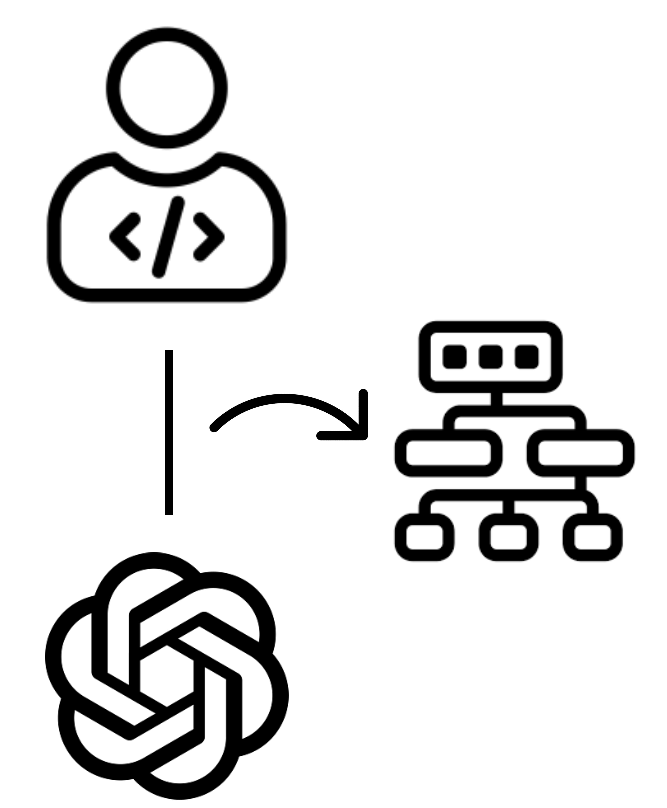

  

<h3 align="center">Architecting Software-intensive Systems with ChatGPT</h3>

  This is the replication package for the paper: "Towards Human-Bot Collaborative Software Architecting with ChatGPT",
   including the data, scripts and so on (see the description below).
   
   
  
## File Organization

1. `Case Study on Architecting the CampusBike Application.pdf`
2. `CollabArch-Logo.png` 
3. `Towards Human-Bot Collaborative Software Architecting with ChatGPT.pdf` 

## Demo Video 
 

  <a href="https://www.youtube.com/embed/oYeH4Sgh_YU">
  
  {:height="100px" width="100px"}[(Youtube)](https://www.youtube.com/embed/oYeH4Sgh_YU)
    
  
  </a>   

## Experiment replication steps

- [Architectural Analysis](#architectural-analysis)
- [Architectural Synthesis](#architectural-synthesis)
- [Architectural Evaluation](#architectural-evaluation)

## Architectural Analysis

  
## Architectural Synthesis

## Architectural Evaluation

